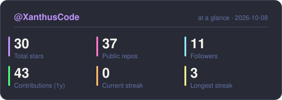
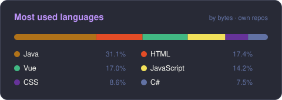

<!-- BANNER — terminal profile.sh --live. Generated by scripts/generate.py from assets/profile.json -->
<picture>
  <source media="(prefers-color-scheme: dark)"  srcset="assets/banner-dark.svg">
  <source media="(prefers-color-scheme: light)" srcset="assets/banner-light.svg">
  
</picture>

 

<!-- NAME / TAGLINE — animated typing -->

 

<!-- SOCIALS -->

 

---

## 👋 This is me

Hi, I'm **Johan**, a self-taught programmer broadcasting from Colombia 🇨🇴.
Passionate about continuous learning and acquiring new knowledge and skills every day.

- 🌱 On a journey to become a **full-stack developer**, constantly learning and evolving.
- ☕ Building backends with **Java & Spring Boot** and interfaces with **React & Vue**.
- 🛡️ Eager to collaborate on **cybersecurity projects**. Let's create something groundbreaking together!
- ⚡ I work tirelessly and never give up until I achieve results that **scale, perform efficiently** and push the boundaries of innovation.
- 💬 Talk to me about **web development, security or learning to code** and you'll have my full attention.

 

## ⚒️ Languages · Frameworks · Tools ⚒️

---

## 📡 signals

<table>
<tr>
<td width="50%" align="center" valign="middle">

<!-- Self-rated radar — edit assets/skills.json, the workflow redraws it -->
<picture>
  <source media="(prefers-color-scheme: dark)"  srcset="assets/radar-dark.svg">
  <source media="(prefers-color-scheme: light)" srcset="assets/radar-light.svg">
  
</picture>

</td>
<td width="50%" align="center" valign="middle">

<!-- Language radar — edit assets/langmix.json -->
<picture>
  <source media="(prefers-color-scheme: dark)"  srcset="assets/radar-langs-dark.svg">
  <source media="(prefers-color-scheme: light)" srcset="assets/radar-langs-light.svg">
  
</picture>

</td>
</tr>
</table>

---

## ⚡ Numbers matter? ohhh yes. ⚡

<!-- Generated into this repo by scripts/generate.py (daily Action) — no shared
     third-party stats instances that go down and take the whole section with them. -->
<picture>
  <source media="(prefers-color-scheme: dark)"  srcset="assets/card-stats-dark.svg">
  <source media="(prefers-color-scheme: light)" srcset="assets/card-stats-light.svg">
  
</picture>
<picture>
  <source media="(prefers-color-scheme: dark)"  srcset="assets/card-langs-dark.svg">
  <source media="(prefers-color-scheme: light)" srcset="assets/card-langs-light.svg">
  
</picture>

---

## 🐍 My Contributions 🐍

<picture>
  <source media="(prefers-color-scheme: dark)"  srcset="assets/snake-dark.svg">
  <source media="(prefers-color-scheme: light)" srcset="assets/snake-light.svg">
  
</picture>

---

` Built with ☕ & curiosity · Colombia 🇨🇴 · @XanthusCode `

